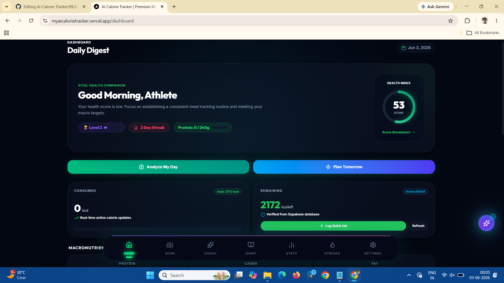
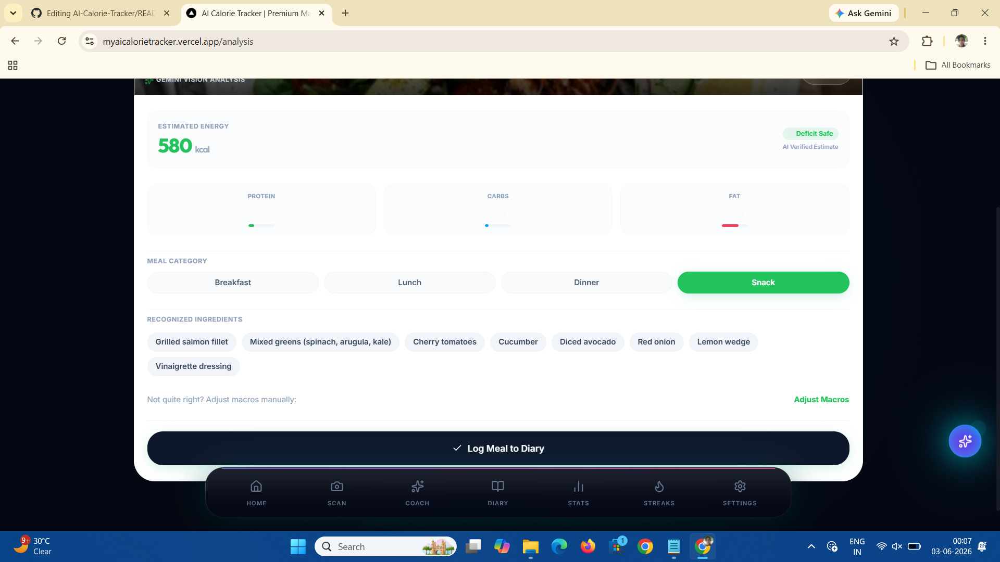
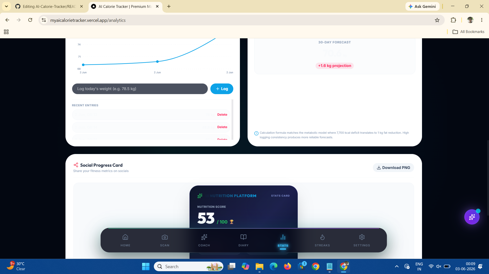
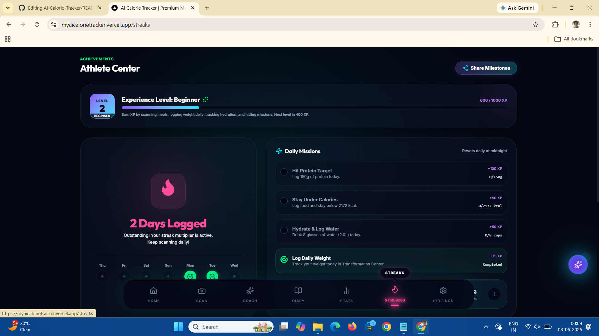

# 🥗 AI Calorie Tracker

> An AI-powered nutrition and fitness companion that analyzes meals from photos, tracks calories and macros, monitors progress, and provides personalized coaching.


---

## 🚀 Live Demo

🔗 **Live App:** [Add Your Deployed Link Here]

🔗 **GitHub Repository:** [Add Your Repository Link Here]

---

## ✨ Features

### 🤖 AI Meal Recognition
- Upload a meal photo
- Gemini Vision identifies food items
- Estimates calories, protein, carbs, and fats
- Confidence scoring for predictions

### 📊 Nutrition Dashboard
- Daily calorie tracking
- Macro tracking
- Progress visualization
- Personalized nutrition goals

### 🏋️ Fitness Goal System
- Fat Loss
- Lean Muscle Gain
- Wellness Maintenance

### 📈 Progress Analytics
- Weight logging
- Weekly progress reports
- Goal achievement tracking
- Historical nutrition trends

### 🔥 Streak & XP System
- Daily logging streaks
- Experience points
- Achievement milestones
- Motivation system

### 🧠 AI Coach
- Personalized nutrition advice
- Fitness recommendations
- Goal-based coaching
- Memory-aware interactions

### 👤 User Profile Management
- Height
- Weight
- Target Weight
- Age
- Activity Level
- Fitness Goals

### 📱 Mobile Responsive Design
- Premium dark theme UI
- Mobile-first experience
- Smooth animations
- Modern dashboard layout

---

## 🏗️ Tech Stack

### Frontend
- Next.js 15
- React
- TypeScript
- Tailwind CSS
- Recharts
- Lucide Icons

### Backend
- Supabase Database
- Supabase Authentication
- Row Level Security (RLS)

### AI
- Google Gemini Vision API
- Nutrition Estimation Engine
- AI Coach Assistant

### Deployment
- Vercel
- GitHub

---

## 📸 Screenshots

### Dashboard


### AI Food Analysis


### Progress Tracking


### Streak System


---

## ⚡ Performance Optimizations

- Image compression before AI processing
- Cached AI analysis results
- Skeleton loading states
- Lazy loading
- Optimized database queries
- Mobile performance tuning

---

## 🗄️ Database Schema

### Users
- Profile Information
- Nutrition Preferences
- Goal Settings

### Meals
- Food Logs
- Calorie Records
- Macro Breakdown

### Weight Logs
- Historical Weight Tracking
- Progress Analytics

### Goals
- Fitness Objectives
- Macro Targets
- Calorie Budgets

### Streaks
- Daily Activity Tracking
- XP Rewards
- Achievement Progress

### Coach Memory
- Personalized User Context
- Historical Recommendations

---

## 🔒 Security

- Supabase Authentication
- Protected Routes
- Row-Level Security Policies
- Environment Variable Protection
- API Key Isolation

---

## 🎯 Future Roadmap

- [ ] Barcode Scanner
- [ ] Food Label OCR
- [ ] Meal Planning
- [ ] Workout Tracking
- [ ] Social Challenges
- [ ] Apple Health Integration
- [ ] Google Fit Integration
- [ ] AI Meal Suggestions
- [ ] Smart Grocery Lists

---

## 🧑‍💻 Local Setup

### Clone Repository

```bash
git clone https://github.com/YOUR_USERNAME/AI-Calorie-Tracker.git
```

### Install Dependencies

```bash
npm install
```

### Create Environment File

```env
NEXT_PUBLIC_SUPABASE_URL=YOUR_SUPABASE_URL
NEXT_PUBLIC_SUPABASE_ANON_KEY=YOUR_SUPABASE_ANON_KEY
GEMINI_API_KEY=YOUR_GEMINI_API_KEY
```

### Run Development Server

```bash
npm run dev
```

Open:

```text
http://localhost:3000
```

---

## 📚 What I Learned

Building this project helped me gain experience with:

- Full Stack Development
- Next.js App Router
- Supabase Authentication
- Database Design
- Row Level Security
- AI Integration
- Image Processing
- Performance Optimization
- Responsive Design
- Production Deployment

---

## 👨‍💻 Author

**Shreyaa Somi**

📧 Email: your-email@example.com

🔗 LinkedIn: Add LinkedIn URL

🔗 Portfolio: Add Portfolio URL

---

## ⭐ Support

If you found this project interesting, consider giving it a star ⭐ on GitHub.

It helps others discover the project and supports future development.
